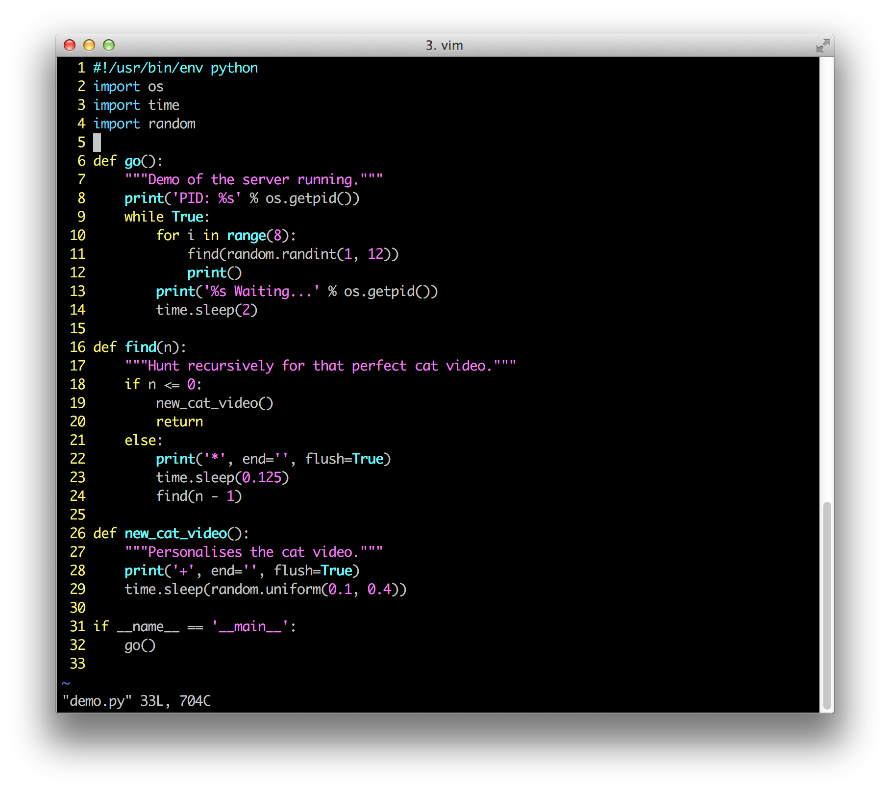
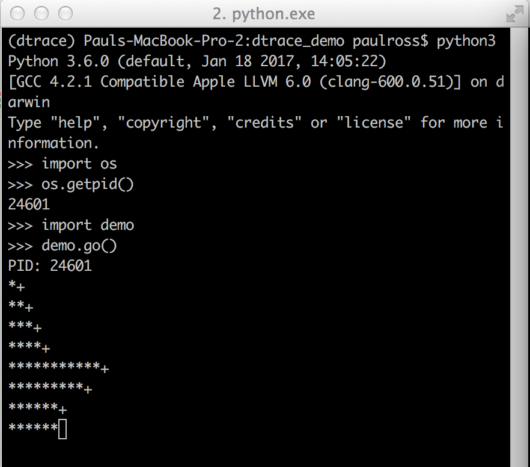
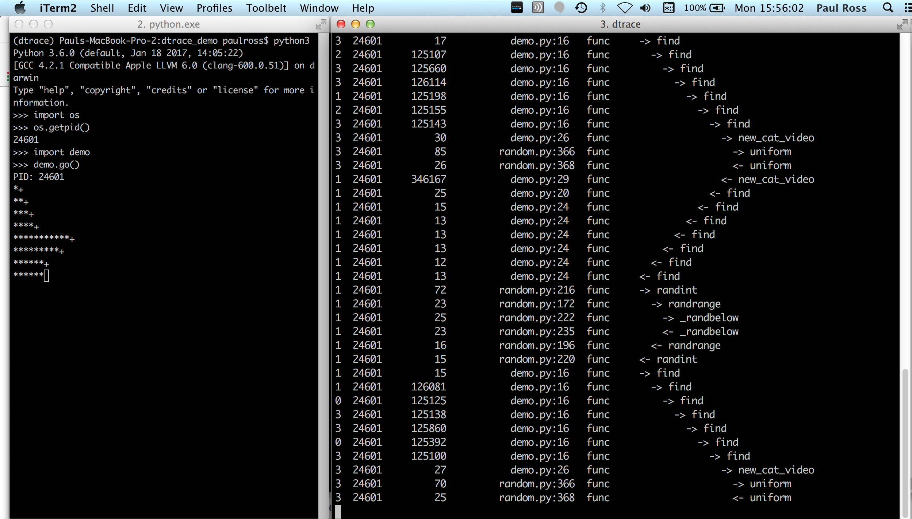
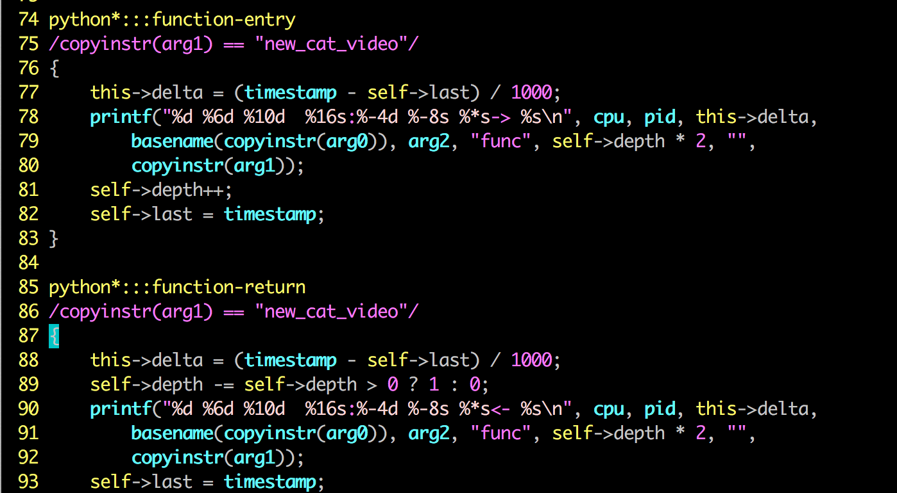
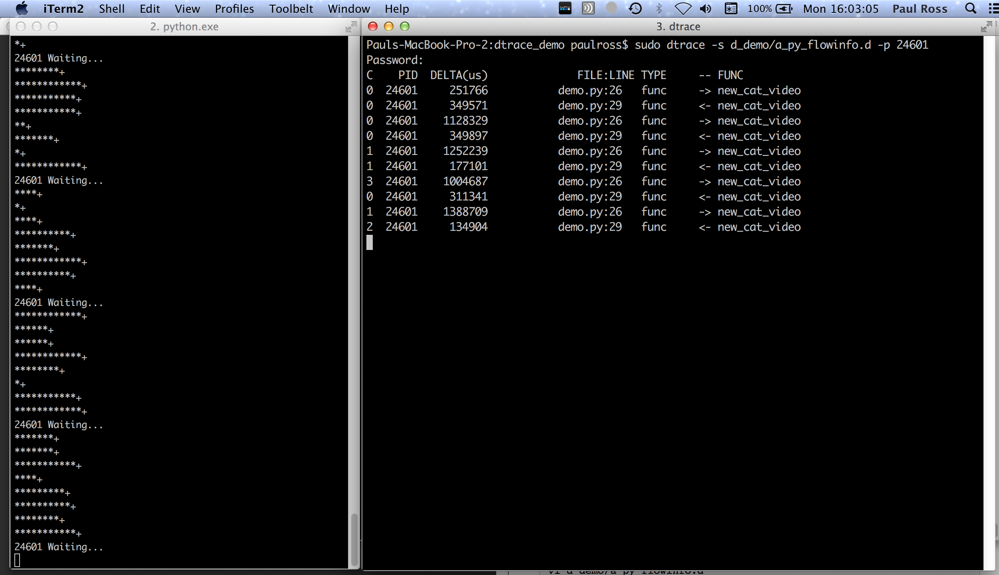
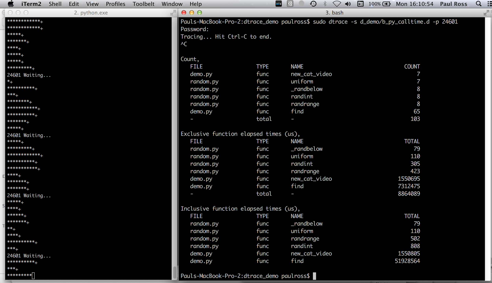
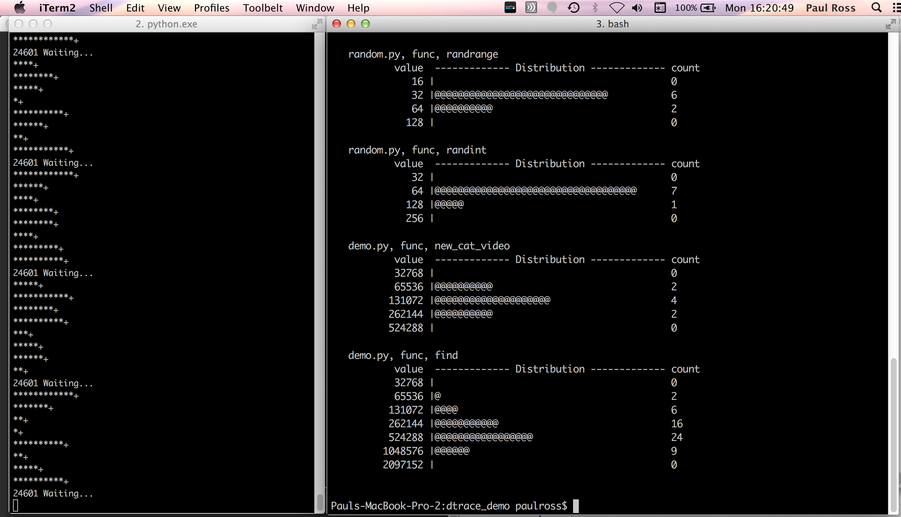

# Dtrace and Python

This is a demonstration of using Dtrace with Python 3.6 suitable for a five minute lightning talk. You need an Apple Mac or another OS with Dtrace support.

The demonstration purports to be one by a hot new startup that creates personalised cat videos showing off it SRE skills by tracing a server in production, live!

# Preparation

Create a dtrace version of Python and a virtual environment in `~/venvs` directory (or wherever you prefer):

```
cd ~/tmp
curl -o Python-3.6.1.tgz https://www.python.org/ftp/python/3.6.1/Python-3.6.1.tgz
tar -xzf Python-3.6.1.tgz
cd Python-3.6.1
./configure --with-dtrace
make
python.exe -m venv ~/venvs/dtrace
```

## Setup

Create three shells, `cd` to the directory this README.md is in.

In the first ('Python') shell, make it around 60 columns wide, activate dtrace Python3.6 and launch it, this will be used to run the python demo continuously:

```
. ~/venvs/dtrace/bin/activate
python3
```

In the second ('Dtrace') shell put it side by side with the 'Python' shell, if you can make it 100 columns wide that would be great.

In a third ('Presentation') shell make it 85 columns wide with the text as large as possible for the presentation.

## Checks

Check that the changes of `d_demo/a_py_flowinfo.d` from a previous demo in function-entry and function-return are absent, the line `/copyinstr(arg1) == "new_cat_video"/` should not be in the functions `python*:::function-entry` and `python*:::function-return`:

Check that the version of Python you are running has probes, I'm assuming PID 24601 here:

```
$ sudo dtrace -l -P python24601
Password:
   ID   PROVIDER            MODULE                          FUNCTION NAME
 4875 python24601          python3          _PyEval_EvalFrameDefault function-entry
 4876 python24601          python3          _PyEval_EvalFrameDefault function-return
 4877 python24601          python3                           collect gc-done
 4878 python24601          python3                           collect gc-start
 4879 python24601          python3          _PyEval_EvalFrameDefault line
```

# The Lightning Talk

In the presentation shell run:

```
$ python3 presentation.py
```

The following keys work:

* `<cr>`  - Next slide.
* `b<cr>` - Previous slide.
* `q<cr>` - Quit
* `r<cr>` - Refresh display (useful after resizing the command line).

When you reach the "Live demo!" slide bring the other two shells to the foreground.

In the dtrace shell bring up the `demo.py` code:



"This is a demo of a hot new startup that will deliver to you every day a personalised cat video. It examines your social media profile and searches the web for just the right cat video for you. Of course this is just a MVP for angel investors.

`go()` represents the server continuously running. It simulates serving 8 requests for cat videos by calling `find()` with a random number to represent the search depth. `find()` then calls `new_cat_video()` that randomly pauses to represent the hard work of personalising a cat video.
"

In the Python shell launch Python, then start the server with:

```
>>> import demo
>>> demo.go()
```

You should see something like this, the PID is important for the next step:



Each `*` represents part of the search and each `+` represents a cat video being personalised.

While this is running we want to trace what is going on.

## Tracing All Python Function Calls

In the dtrace shell:

```
$ sudo dtrace -s d_demo/a_py_flowinfo.d -p 24601
```

`Ctrl-C` to stop, you should see something like this:



On the right we have the following columns for each function call or return:

1. Core number.
2. PID.
3. Delta time in microseconds from previous line.
4. Source file and line number.
5. Type of the probe, in all these cases it is func but garbage collection start/stop is also possible.
6. Function, indented by stack depth.

This even traces the standard library of course.

"I don't want the whole call stack, its too much, just give me the `new_cat_video()` function call."

## Tracing a Specific Function

You can edit `d_demo/a_py_flowinfo.d` to show only the function `new_cat_video()` by copying line 53:

```
$ vi d_demo/a_py_flowinfo.d
```

An inserting it as lines 75 and 86:



Running the same command:

```
$ sudo dtrace -s d_demo/a_py_flowinfo.d -p 24601
```
You should see something like this:



## Function Counting

This aggregates the the function calls and the execution time. Use the command:

```
$ sudo dtrace -s d_demo/b_py_calltime.d -p 24601
```

Wait for a few seconds then hit `Ctrl-C` and you will see:



This gives the count of function calls and the inclusive and exclusive time spent in them in microseconds.

"But all those numbers, can't we have pictures?"

## Function Execution Time Histogram

With the command:

```
$ sudo dtrace -s d_demo/c_py_calldist.d -p 24601
```

You should see an ASCII histogram, note `demo.py, func, new_cat_video` second table from the bottom:



That is the demo over, now back to the presentation shell and finish that off.

With a little practice this can all be done in less than 5 minutes.

# Further Resources

* Dtrace on [Wikipedia](http://en.wikipedia.org/wiki/DTrace)
* The Dtrace [website](http://dtrace.org/blogs/).
* Brendan Gregg on [Dtrace](http://www.brendangregg.com/dtrace.html) and the [Dtrace toolkit](http://www.brendangregg.com/dtracetoolkit.html).
* Brendan on [eBPF](http://www.brendangregg.com/ebpf.html), the Linux equivalent ot Dtrace.

In this repo you will find a other Dtrace `*.d` files for Python in the `toolkit/` directory.
